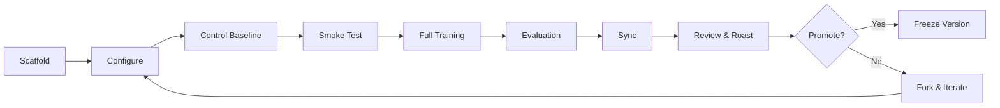

<p align="center">
  <h1 align="center">🔬 AutoResearch by Harsh Vardhan</h1>
  <p align="center">
    <em>A domain-agnostic, pluggable framework for autonomous ML research — from scaffold to review.</em>
  </p>
  <p align="center">
    <a href="LICENSE"></a>
    <a href="https://www.python.org/downloads/"></a>
    <a href="https://pytorch.org/"></a>
    <a href="https://wandb.ai/"></a>
    
    
  </p>
</p>

---

## What is AutoResearch?

AutoResearch is a **closed-loop autonomous ML research framework** inspired by [Karpathy's autoresearch](https://github.com/karpathy/autoresearch) and the [AR by HV pipeline design](docs/Autonomous%20ML%20Project%20Pipeline%20Design.md). It provides a structured, reproducible lifecycle for ML experiments:

```
Scaffold → Configure → Train → Evaluate → Sync → Review → Promote
```

Unlike monolithic experiment scripts, AutoResearch separates **what** you research (domains) from **how** you manage it (lifecycle), making it trivial to add new research lanes without touching the core engine.

### Key Features

- 🔌 **Pluggable Domains** — Add a new ML domain with zero modifications to the core. Each domain is auto-discovered via `domain.yaml` manifests.
- 📊 **W&B Experiment Tracking** — Built-in Weights & Biases integration with graceful fallback to a local null tracker when offline.
- 🔁 **Full Lifecycle Management** — Scaffold, version, train, evaluate, sync, review, and promote experiments through a single CLI.
- 🎯 **Frozen Ablation Plans** — Configs are immutable per version, preventing goal-drift during autonomous runs.
- 📝 **Automated Review & Roast** — Every version gets a structured audit, metric delta analysis, and ablation suggestions.
- 🧪 **47 Tests, Zero Failures** — Comprehensive test suite covering all three domains.

---

## Shipped Domains & Real Results

| Domain | Description | Primary Metric | Control Baseline | Trained Model | Improvement |
|--------|-------------|---------------|-----------------|--------------|-------------|
| **`hndsr_vr`** | Satellite super-resolution | PSNR ↑ | Bicubic baseline | SR3 diffusion | — |
| **`nlp_lm`** | Character-level language model | BPB ↓ | Bigram: **6.38** | GPT-nano: **3.59** | **44% ↓** |
| **`tabular_cls`** (Iris) | Flower classification | Accuracy ↑ | Logistic: **16.7%** | MLP: **93.3%** | **+76.7pp** |
| **`tabular_cls`** (Titanic) | Survival prediction | Accuracy ↑ | Logistic: **58.3%** | MLP: **83.6%** | **+25.3pp** |

> All results above are real, measured outputs from runs executed during development — not estimates.

---

## Quick Start

### 1. Clone & Install

```bash
git clone https://github.com/The-Harsh-Vardhan/autoresearch-by-harsh-vardhan.git
cd autoresearch-by-harsh-vardhan

# Create virtual environment
python -m venv .venv

# Activate (Linux/Mac)
source .venv/bin/activate
# Activate (Windows PowerShell)
.venv\Scripts\activate

# Install with dev dependencies
pip install -e ".[dev]"
```

### 2. (Optional) Set Up W&B Tracking

Create a `.env` file in the repo root:

```bash
WANDB_API_KEY=your_wandb_api_key_here
```

> If no API key is set, runs will automatically use the local null tracker — no errors, no data loss. You can sync to W&B later.

### 3. Discover Domains

```bash
python -m autoresearch_hv list-domains
```

```
Name                 Display Name                             Primary Metric
--------------------------------------------------------------------------------
hndsr_vr             HNDSR Satellite Super-Resolution         psnr_mean
nlp_lm               NLP Language Modelling                   val_bpb
tabular_cls          Tabular Classification                   accuracy
```

### 4. Run Your First Experiment (Iris — 30 seconds)

```bash
# Scaffold version v1.0 for the tabular domain
python -m autoresearch_hv --domain tabular_cls scaffold-version --version v1.0 --force

# Run the logistic regression control baseline
python -m autoresearch_hv.domains.tabular_cls.train_runner \
  --config configs/tabular_cls/v1.0_control.yaml \
  --run-name v1.0-control --device cpu

# Train the MLP (30 epochs, ~10 seconds on CPU)
python -m autoresearch_hv.domains.tabular_cls.train_runner \
  --config configs/tabular_cls/v1.0_train.yaml \
  --run-name v1.0-train --device cpu

# Evaluate the trained model
python -m autoresearch_hv.domains.tabular_cls.evaluate_runner \
  --config configs/tabular_cls/v1.0_train.yaml \
  --run-name v1.0-eval \
  --checkpoint artifacts/v1.0-train/checkpoints/v1.0_train_best.pt \
  --device cpu

# Sync results and generate a review
python -m autoresearch_hv --domain tabular_cls sync-run --version v1.0 --source-dir artifacts/v1.0-train
python -m autoresearch_hv --domain tabular_cls review-run --version v1.0

# Validate the version contract
python -m autoresearch_hv --domain tabular_cls validate-version --version v1.0
```

### 5. Run the NLP Domain (Language Modelling — ~5 minutes)

```bash
# Scaffold
python -m autoresearch_hv --domain nlp_lm scaffold-version --version v1.0 --force

# Control baseline (bigram)
python -m autoresearch_hv.domains.nlp_lm.train_runner \
  --config configs/nlp_lm/v1.0_control.yaml --run-name v1.0-control --device cpu

# Full training (GPT-nano, 5 epochs on tiny_shakespeare)
python -m autoresearch_hv.domains.nlp_lm.train_runner \
  --config configs/nlp_lm/v1.0_train.yaml --run-name v1.0-train --device cpu

# Evaluate
python -m autoresearch_hv.domains.nlp_lm.evaluate_runner \
  --config configs/nlp_lm/v1.0_train.yaml --run-name v1.0-eval \
  --checkpoint artifacts/v1.0-train/checkpoints/v1.0_train_best.pt --device cpu

# Sync + Review + Validate
python -m autoresearch_hv --domain nlp_lm sync-run --version v1.0 --source-dir artifacts/v1.0-train
python -m autoresearch_hv --domain nlp_lm review-run --version v1.0
python -m autoresearch_hv --domain nlp_lm validate-version --version v1.0
```

---

## Architecture

```
src/autoresearch_hv/
├── core/                         Domain-agnostic engine
│   ├── interfaces.py             Protocols every domain implements (DomainLifecycleHooks)
│   ├── domain_registry.py        Auto-discovers domains from domain.yaml manifests
│   ├── lifecycle.py              Generic lifecycle (scaffold → sync → review → promote)
│   ├── tracker.py                W&B tracker + NullTracker fallback
│   └── utils.py                  Config loading, .env support, path helpers, seeding
│
├── domains/                      Pluggable research lanes
│   ├── hndsr_vr/                 CV: satellite super-resolution (SR3, PSNR ↑)
│   ├── nlp_lm/                   NLP: character-level LM (GPT-nano, BPB ↓)
│   └── tabular_cls/              Tabular: classification (MLP, Accuracy ↑)
│
└── cli.py                        --domain dispatch CLI

configs/                          YAML configs with `inherits:` support
├── hndsr_vr/                     base.yaml + per-version control/smoke/train
├── nlp_lm/
└── tabular_cls/

benchmarks/                       Measured control baselines (JSON)
programs/                         Human-owned research program docs
tests/                            47 tests across 7 test files
```

### How Domain Auto-Discovery Works

```
1. domain_registry.py scans all subpackages under domains/
2. Each domain has a domain.yaml manifest declaring name, metrics, model kinds, etc.
3. The CLI auto-discovers all domains — zero registration code
4. Each domain implements the DomainLifecycleHooks protocol
5. The generic lifecycle.py dispatches to domain hooks for all operations
```

### The Lifecycle Loop



---

## CLI Reference

```bash
python -m autoresearch_hv [command] --domain [domain_name]
```

### Global Commands

| Command | Description |
|---------|-------------|
| `list-domains` | Show all discovered research domains |
| `domain-info --domain <name>` | Show details of a specific domain |

### Lifecycle Commands (require `--domain`)

| Command | Description |
|---------|-------------|
| `scaffold-version --version <v>` | Create notebook, doc, review, and config assets |
| `validate-version --version <v>` | Validate a version's contract (all files exist) |
| `push-kaggle --version <v>` | Push a notebook to Kaggle |
| `kaggle-status --version <v>` | Check Kaggle kernel status |
| `pull-kaggle --version <v>` | Pull Kaggle outputs into artifacts |
| `sync-run --version <v>` | Index pulled outputs into a run manifest |
| `review-run --version <v>` | Generate a review + roast + ablation suggestions |
| `mirror-obsidian --version <v>` | Generate an Obsidian mirror note |
| `next-ablation --version <v>` | Write next bounded ablation suggestions |

---

## W&B Experiment Tracking

AutoResearch includes full [Weights & Biases](https://wandb.ai/) integration:

- **Online mode**: Streams metrics, configs, and artifacts to the W&B cloud in real-time
- **Offline mode**: Logs locally, sync to W&B later via `wandb sync`
- **Null fallback**: If `wandb` isn't installed or configured, a local `NullTracker` records everything to JSON — nothing is lost

### Setup

1. Create a `.env` file: `WANDB_API_KEY=your_key`
2. Set `tracking.mode: online` in your config YAML (default)
3. That's it — all train/eval runners auto-load `.env` and initialize W&B

### What Gets Tracked

| Artifact | Description |
|----------|-------------|
| Config manifest | Full resolved YAML config as a W&B artifact |
| Dataset split manifest | Train/val sizes, feature names, class names |
| Epoch metrics | Loss, accuracy, BPB, perplexity (per-epoch) |
| Best checkpoint | Saved as a W&B artifact with lineage |
| Train/eval summaries | JSON summaries with all metrics |

---

## Adding a New Domain

Creating a new research domain requires **zero changes** to the core engine:

```
src/autoresearch_hv/domains/your_domain/
├── __init__.py
├── domain.yaml          # Name, metrics, model kinds, entrypoints
├── lifecycle.py         # LifecycleHooks class (implements protocol)
├── models.py            # Your model architectures
├── dataset.py           # Data loading and preprocessing
├── metrics.py           # Domain-specific metric functions
├── train_runner.py      # Training entry point with W&B tracking
└── evaluate_runner.py   # Evaluation entry point with W&B tracking
```

Then add:
- `configs/your_domain/base.yaml` + version configs
- `benchmarks/your_domain_registry.json`
- `programs/your_domain.md`
- `tests/test_your_domain.py`
- One line in `pyproject.toml` → `package-data`

The CLI discovers your domain automatically. See [CONTRIBUTING.md](CONTRIBUTING.md) for details.

---

## Project Layout

```
.
├── src/autoresearch_hv/           Core engine + 3 domains
├── configs/                       YAML configs with inherits support
│   ├── hndsr_vr/                  Satellite SR configs
│   ├── nlp_lm/                    NLP language model configs
│   └── tabular_cls/               Tabular classification configs
├── data/                          Datasets (titanic.csv, tiny_shakespeare cached)
├── benchmarks/                    Measured baseline registries (JSON)
├── programs/                      Research program docs
├── docs/                          Per-version run docs, design docs
├── notebooks/versions/            Immutable Kaggle/Colab notebooks
├── reports/
│   ├── reviews/                   Per-version audit/roast docs
│   └── generated/                 Auto-generated ablation suggestions
├── tests/                         47 tests across 7 files
├── pyproject.toml                 Build config and dependencies
├── CONTRIBUTING.md                Dev setup & contribution guide
└── LICENSE                        MIT
```

---

## Testing

```bash
# Run all 47 tests
python -m pytest tests/ -v

# Run a specific domain's tests
python -m pytest tests/test_tabular_domain.py -v
python -m pytest tests/test_nlp_domain.py -v

# Quick run (quiet mode)
python -m pytest tests/ -q
```

| Test File | Tests | Coverage |
|-----------|-------|----------|
| `test_core.py` | 16 | Domain registry, config loading, utils, seeding |
| `test_tabular_domain.py` | 9 | Auto-discovery, models, dataset, metrics, lifecycle |
| `test_nlp_domain.py` | 6 | GPT-nano, bigram, dataset, metrics |
| `test_domain_registry.py` | 5 | Multi-domain discovery, manifest validation |
| `test_cli_dispatch.py` | 3 | CLI argument parsing, domain dispatch |
| `test_runtime_contract.py` | 6 | Path resolution, workspace isolation |
| `test_lifecycle_review.py` | 1 | Full sync → review pipeline (monkeypatched) |
| `test_notebook_contract.py` | 1 | Notebook structure validation |

---

## Inspirations

This project builds on ideas from:

- **[Karpathy's autoresearch](https://github.com/karpathy/autoresearch)** — The autonomous iteration loop with a frozen `program.md`
- **[Sakana AI's AI Scientist](https://github.com/sakanaai/ai-scientist)** — Automated scientific discovery (lessons learned from its [42% failure rate](https://arxiv.org/html/2502.14297v2))
- **[AutoKaggle](https://github.com/multimodal-art-projection/AutoKaggle)** — Multi-agent Kaggle orchestration
- **[W&B Experiment Tracking](https://wandb.ai/)** — MLOps telemetry backbone

See [Autonomous ML Project Pipeline Design](docs/Autonomous%20ML%20Project%20Pipeline%20Design.md) for the full architectural blueprint.

---

## License

[MIT](LICENSE) — Use it, fork it, extend it.
